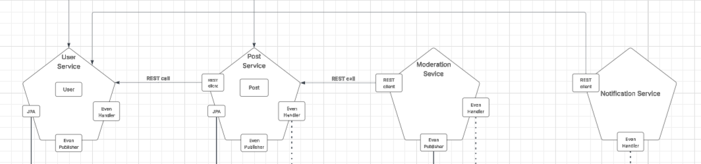

# System Architecture

## Tổng quan hệ thống
- Hệ thống được xây dựng nhằm xử lý quy trình đăng bài viết trên một diễn đàn theo mô hình dịch vụ microservices.
- Mục tiêu là đảm bảo bài viết được kiểm duyệt nội dung trước khi công khai, đồng thời duy trì tính nhất quán dữ liệu giữa các dịch vụ thông qua kiến trúc bất đồng bộ.
### Đặc điểm nổi bật
- Các bài viết (posts) được tạo, quản lý và kiểm duyệt thông qua một chuỗi xử lý phân tán sử dụng kafka
- Outbox Pattern được sử dụng để đảm bảo tính nhất quán giữa cơ sở dữ liệu và các sự kiện được gửi đến các dịch vụ khác
- Kafka là hệ thống truyền tải sự kiện, cho phép các dịch vụ giao tiếp với nhau theo cách bất đồng bộ, tăng tính linh hoạt và khả năng mở rộng

### Các dịch vụ chính và chức năng
1. User service
   - Chịu trách nhiệm tạo tài khoản người dùng
   - Cho phép các dịch vụ khác lấy thông tin người dùng để phục vụ cho các tác vụ liên quan (ví dụ: hiển thị tên người đăng bài, gửi thông báo,...)

2. Post service
   - Cung cấp chức năng tạo bài viết mới
      - Sử dụng Outbox Pattern để ghi nhận sự kiện "bài viết mới" và gửi lên Kafka cho dịch vụ kiểm duyệt
   - Cho phép lấy thông tin chi tiết bài viết (dùng cho hiển thị trên diễn đàn, hoặc để kiểm duyệt)
   - Cập nhật trạng thái bài viết (ví dụ: đã kiểm duyệt, bị từ chối, đang chờ xét duyệt)
      - Lắng nghe các sự kiện từ Kafka (do Moderation Service gửi) để cập nhật trạng thái bài viết tương ứng

3. Moderation Service
   - Nhận các bài viết cần kiểm duyệt từ Kafka
   - Thực hiện kiểm tra tiêu đề và nội dung bài viết, đảm bảo không vi phạm quy tắc cộng đồng (ví dụ: không chứa nội dung phản cảm, spam, vi phạm pháp luật,...)

4. Notification Service
   - Nhận các sự kiện kiểm duyệt hoặc sự kiện trạng thái bài viết từ Kafka
   - Gửi thông báo đến người dùng tương ứng:
      - Bài viết đã được phê duyệt
      - Bài viết bị từ chối
      - Có bài viết mới

## Tóm tắt luồng xử lý chính
1. Người dùng tạo bài viết thông qua Post Service
2. Post Service lưu bài viết vào DB, ghi Outbox → Kafka gửi sự kiện “bài viết mới”
3. Moderation Service nhận sự kiện, kiểm duyệt nội dung
4. Moderation Service ghi kết quả vào DB, ghi Outbox → Kafka gửi sự kiện “kết quả kiểm duyệt”
5. Post Service nhận kết quả và cập nhật trạng thái bài viết
6. Notification Service nhận sự kiện và gửi thông báo đến người dùng

## Thành phần hệ thống
- **Post Service**
   - Chịu trách nhiệm quản lý vòng đời của các bài viết trên diễn đàn
   - Thực hiện các chức năng như: tạo bài viết, lấy thông tin bài viết và cập nhật trạng thái bài viết
   - Sử dụng Outbox Pattern để ghi nhận sự kiện (ví dụ: bài viết mới được tạo) và gửi lên Kafka, từ đó kích hoạt các xử lý phía sau như kiểm duyệt
   - Đồng thời lắng nghe các kết quả kiểm duyệt từ Kafka để cập nhật trạng thái bài viết tương ứng (ví dụ: đã duyệt, bị từ chối)

- **Moderation Service**
   -  Thực hiện kiểm tra tiêu đề và nội dung bài viết nhằm đảm bảo tuân thủ các quy định và hướng dẫn cộng đồng
   - Đăng ký lắng nghe các sự kiện bài viết mới từ Kafka, sau đó tiến hành kiểm duyệt nội dung
   - Ghi lại kết quả kiểm duyệt vào cơ sở dữ liệu và sử dụng Outbox Pattern để phát sự kiện kết quả kiểm duyệt (ví dụ: đã duyệt, từ chối) lên Kafka

- **User Service**
   - Cung cấp các chức năng chính
   - Tạo tài khoản mới
   - Lấy thông tin người dùng phục vụ cho các dịch vụ khác

- **Notification Service**
   - Chịu trách nhiệm gửi thông báo đến người dùng như bài viết đã được kiểm duyệt hoặc từ chối

- **API Gateway**
   - Là cổng vào chính cho tất cả các client bên ngoài (ví dụ: giao diện web, ứng dụng di động)
   - Có nhiệm vụ điều phối và chuyển tiếp các yêu cầu HTTP đến đúng dịch vụ backend (ví dụ: User Service, Post Service)

## Giao tiếp giữa các dịch vụ
1. Hình thức giao tiếp
   - Hệ thống sử dụng kết hợp cả giao tiếp đồng bộ và bất đồng bộ giữa các dịch vụ

+ Giao tiếp đồng bộ - REST API
   + Được sử dụng khi cần truy vấn dữ liệu trực tiếp hoặc thực hiện các thao tác có phản hồi ngay lập tức
   + Như:
      + API Gateway gọi đến User Service để xác thực hoặc lấy thông tin người dùng
      + API Gateway gọi đến Post service để thực hiện đăng bài hoặc lấy thông tin bài đăng
      + Post Service gọi nội bộ đến User Service để lấy thông tin người đăng bài
      + Moderation service gọi nội bộ đến Post Service để lấy thông tin bài viết
      + Notification service gọi nội bộ đến User Service để lấy thông tin người dùng
   + 

+ Giao tiếp bất đồng bộ – Kafka (Message Queue)
   + Được sử dụng để xử lý các tác vụ nền, không yêu cầu phản hồi tức thì
   + Tăng khả năng mở rộng, giảm độ phụ thuộc giữa các dịch vụ
      + Như:
         + Post Service phát sự kiện “bài viết mới” lên Kafka → Moderation Service nhận và kiểm duyệt
         + Moderation Service gửi kết quả kiểm duyệt lên Kafka → Post Service và Notification Service nhận để xử lý tiếp
      + Các dịch vụ phát sự kiện sử dụng Outbox Pattern để đảm bảo dữ liệu được gửi lên Kafka một cách an toàn và nhất quán
   + 

2. Kết nối mạng nội bộ
- Tên dịch vụ (service name) trong Docker Compose
- Mỗi service được định danh qua container_name và có thể được gọi qua tên dịch vụ bên trong mạng my-network
- Ví dụ:
   - post-service gọi user-service qua URL
      - http://user-service:8081/users/all
- Cấu hình mạng
   - 

3. Các thành phần hạ tầng hỗ trợ giao tiếp

| Thành phần     | Chức năng chính                                                                                                     |
|----------------|---------------------------------------------------------------------------------------------------------------------|
| Broker (Kafka) | Truyền tải các sự kiện giữa các service. Lắng nghe tại broker:29092                                                 | 
|  redis         | Xử lý Idempotent                                                                                                    | 
|connect (Kafka Connect) | Service connect sử dụng Debezium để theo dõi thay đổi dữ liệu trong Mysql và gửi lên kafka                          | 

[//]: # (## Data Flow)

[//]: # (- Explain the flow of data between services and the gateway.)

[//]: # (- Include any external dependencies &#40;e.g., databases, third-party APIs&#41;.)

## Kiến trúc tổng quan
- 

## Scalability & Fault Tolerance
